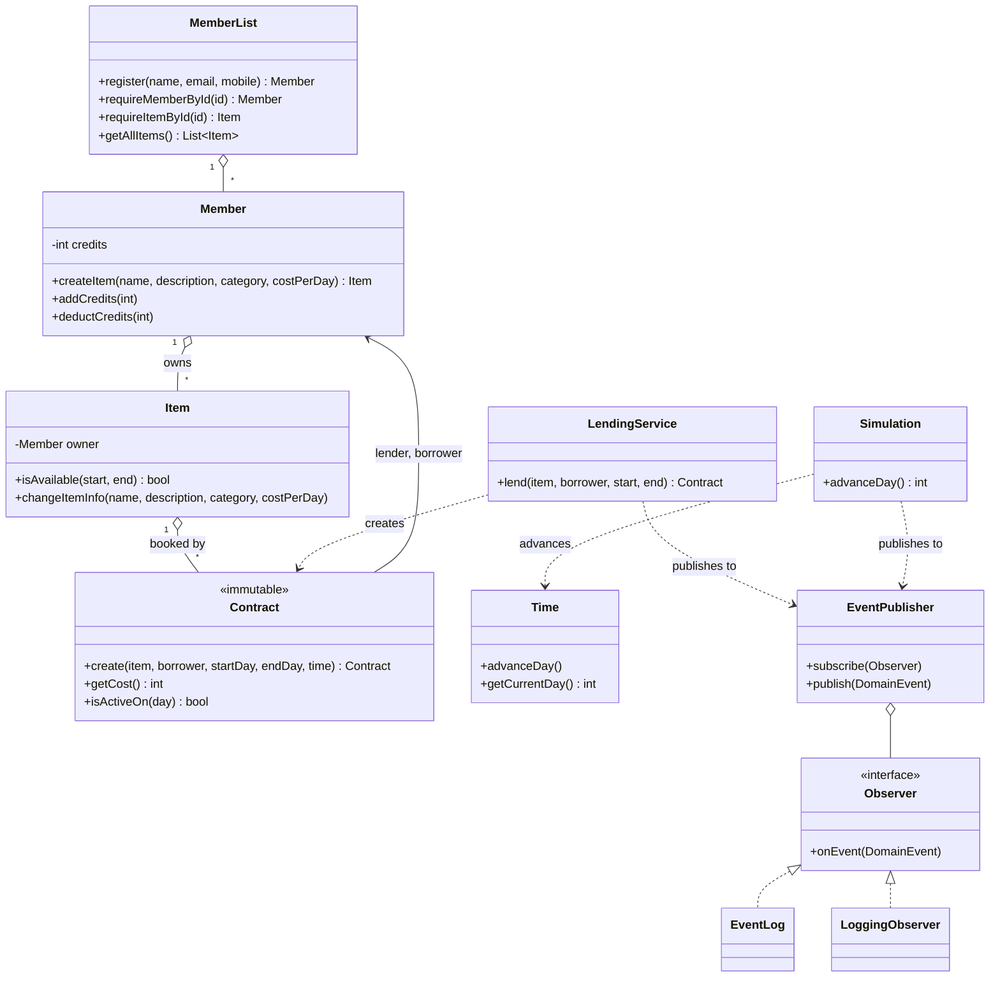
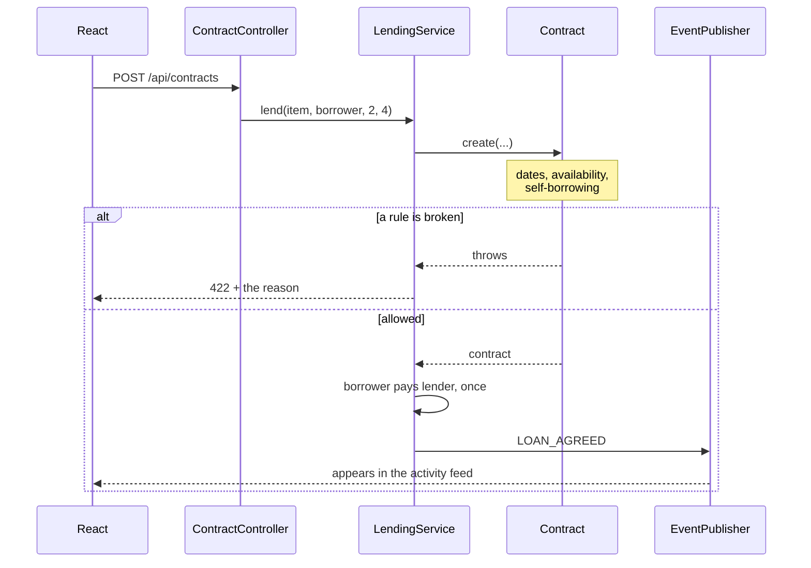

# BorrowBox

A peer-to-peer lending system. Members list things they own, borrow each other's for a run of days, and pay for them in credits. Time is simulated: nothing happens until someone advances the day.

[](https://github.com/kalleSdev/borrowbox/actions/workflows/ci.yml)

**Java 21 · Spring Boot 3 · React 19 · TypeScript · Tailwind · 119 tests**

<!-- screenshots go here -->

---

## What it does

Everyone starts with a balance of credits. Listing an item earns you 100, which is what keeps credits flowing into the pool. Borrowing costs the owner's daily rate for every day of the loan, both ends included, and that money goes from the borrower to the lender.

The calendar is the interesting part. There are no real dates anywhere — loans are booked against day numbers, and the whole system sits still until you press **Advance the day**. That is what starts and ends loans, and each one shows up in the activity feed as it happens.

The rules the system will not let you break:

| Rule | What happens |
|---|---|
| A loan cannot start in the past | `422` with the reason |
| A loan cannot end before it starts | `422` |
| An item cannot be booked twice over the same days | `422` — the calendar is inclusive, so days 2–6 means busy on day 6 and free on day 7 |
| A borrower cannot spend credits they do not have | `422`, and nothing is charged |
| A member cannot borrow their own item | `422` |
| An email or mobile belongs to exactly one member | `409` |
| An item with loans against it cannot be deleted | `409` — removing it would take the loan history with it |

---

## Running it

Two processes. You need JDK 21 and Node 20+.

```bash
cd backend && mvn spring-boot:run
```

```bash
cd frontend && npm install && npm run dev
```

The app is on **http://localhost:5173** and the API on **http://localhost:8080**. The dev server proxies `/api` through, so there is no CORS to configure locally. Three members and two items are seeded at startup so there is something to click.

Browsable API docs, where you can fire real requests without installing anything: **http://localhost:8080/swagger-ui.html**

```bash
cd backend && mvn test
```

---

## How it is put together

```
backend/
  api/         REST controllers, request/response DTOs, the exception handler
  model/       the domain — no Spring annotations anywhere in here
  config/      the one place that knows the domain runs inside a container
frontend/
  api/         typed client, mirrored response types, TanStack Query hooks
  components/  shared UI and the dialogs
  pages/       dashboard, catalogue, item, members, loans
```

The domain classes are plain Java. Nothing in `model/` imports Spring, which means the 80 domain tests construct their objects directly and run in milliseconds without starting a context. `DomainConfig` is the single file that wires them up as beans.

The model also knows nothing about HTTP. It throws `LendingNotAllowedException` when a rule is broken; `ApiExceptionHandler` is what decides that this means `422`. Every error comes back as an [RFC 7807](https://datatracker.ietf.org/doc/html/rfc7807) problem detail with a message already written for a person, so the frontend never has to invent its own wording per status code:

```json
{
  "title": "Not allowed",
  "status": 422,
  "detail": "The borrower has 100 credits but this loan costs 250.",
  "instance": "/api/contracts"
}
```

### The domain



### Booking a loan



---

## The three patterns, and where you can see them

This started as a design-patterns assignment. Rather than leave the patterns as something you have to read the code to find, each one drives a feature you can click.

**Strategy — the catalogue filters.** `SearchStrategy` has two implementations. `GET /api/items?name=drill` sets one on the context, `?maxPrice=30` sets the other, and passing both runs the results through each in turn. The search bar is the pattern.

**Observer — the activity feed.** `EventPublisher` fans typed events out to whoever subscribed. `EventLog` keeps them, which is what `GET /api/events` reads back; `LoggingObserver` writes them to the server log. Neither is known to the code raising the event.

**Simulated clock.** `Time` is a day counter. `Simulation.advanceDay()` moves it and announces every loan starting or ending, which is why advancing the day returns the events it caused in the same response.

---

## API

| | | |
|---|---|---|
| `GET` | `/api/members` | Everyone |
| `POST` | `/api/members` | Sign up — `409` if the email or mobile is taken |
| `GET` `PUT` `DELETE` | `/api/members/{id}` | One member |
| `GET` | `/api/items?name=&maxPrice=` | The catalogue, filtered by the search strategies |
| `POST` | `/api/items` | List an item, paying the owner the bonus |
| `GET` `PUT` `DELETE` | `/api/items/{id}` | One item, with its booking history |
| `GET` | `/api/contracts?memberId=` | Loans, optionally for one member |
| `POST` | `/api/contracts` | Book an item out |
| `GET` | `/api/clock` | What day it is |
| `POST` | `/api/clock/advance` | Move to the next day, and get back what it brought |
| `GET` | `/api/events?limit=` | Activity feed, newest first |

---

## Tests

119 of them. The domain tests need no Spring context; the API tests drive real requests through MockMvc and assert on the JSON and the status codes.

```
mvn test          # 119 tests
npx tsc -b        # frontend typecheck
npx oxlint src    # frontend lint
```

---

## Where this came from

The first commit is a university OOP assignment exactly as it was handed in: a console app, no tests, no build file. Everything after it is the rebuild, one concern per commit, so the history is readable as a sequence of decisions rather than a single dump.

Writing the tests before touching anything was worth it. They pinned down what already worked and made the following genuine bugs safe to fix:

- **The observer never fired.** A contract raised its event inside its constructor, but the only caller attached the listener on the line after. The list was always empty at the point it was read.
- **Every loan was charged three times, to the wrong person.** The constructor deducted from the lender, then `addContract` deducted again for each of the two members the contract was filed against. The borrower should have been paying the lender.
- **Items could be double-booked.** `Item` and `Contract` each had their own overlap check and disagreed about whether the last day counted. The one guarding new bookings was the lenient one.
- **The uniqueness check was bypassed.** `MemberList` kept sets of taken emails, but only one of the two creation paths updated them — and the menu used the other one.
- **Items had no owner.** `Item.ownerId` was declared and never written to, so every item printed "Owner not found".

## What is next

- Persist to a database with Spring Data JPA — H2 by default, a Postgres profile for deployment
- GitHub Actions running both builds
- A deployed demo
